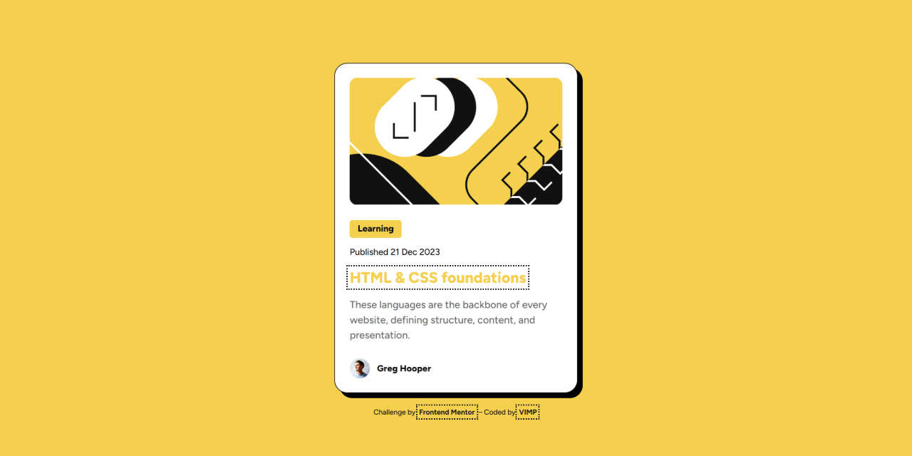

# 🚀 Blog preview card solution &ndash; Frontend Mentor

A responsive blog preview card built with semantic HTML and modern CSS, focused on accessibility, clean structure, and scalable styling practices.

This is a solution to the [Blog preview card challenge on Frontend Mentor](https://www.frontendmentor.io/challenges/blog-preview-card-ckPaj01IcS).

---

## 🎬 Demo

---

## 🔗 Links

- 🌎 [Live site](https://vimpdev.github.io/fem-17-blog-preview-card/)
- 📌 [Frontend Mentor Solution](https://www.frontendmentor.io/solutions/blog-preview-card-semantic-html-and-modern-css-bn4c8L0_Sp)

---

## 🎯 Features

- Interactive hover and focus states for all elements
- Accessible keyboard navigation
- Responsive layout across devices

---

## 📸 Screenshots

| 📱 Mobile | 📲 Tablet | 🖥️ Desktop |
| --- | --- | --- |
|  |  |  |

---

## 🛠️ Built with

- Semantic HTML5
- CSS custom properties (design tokens)
- Flexbox
- Mobile-first workflow

---

## 🧠 What I learned

### 1. Semantic structure matters
Using proper HTML elements (`main`, `article`, `time`) improves both accessibility and maintainability.

### 2. Accessibility is not optional
- Implemented `:focus-visible` for keyboard navigation
- Relied on semantic HTML to avoid unnecessary ARIA

### 3. CSS architecture decisions
- Used design tokens via `:root` for scalability
- Applied `clamp()` for fluid typography
- Avoided global overrides that could break components

---

## 🤖 AI Collaboration

AI tools were used as part of a guided development workflow to simulate real-world code reviews and improve code quality.

- Validated semantic HTML and accessibility decisions
- Refined CSS structure and best practices
- Improved commit conventions and project organization

---

## 👩‍💻 Author

- Frontend Mentor &ndash; [@vimpdev](https://www.frontendmentor.io/profile/vimpdev)

---